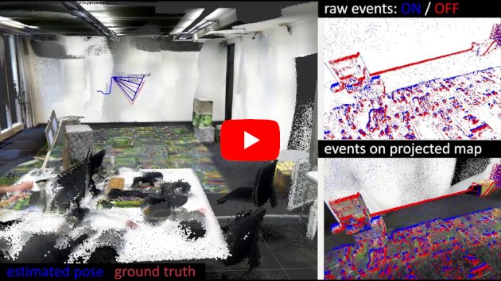
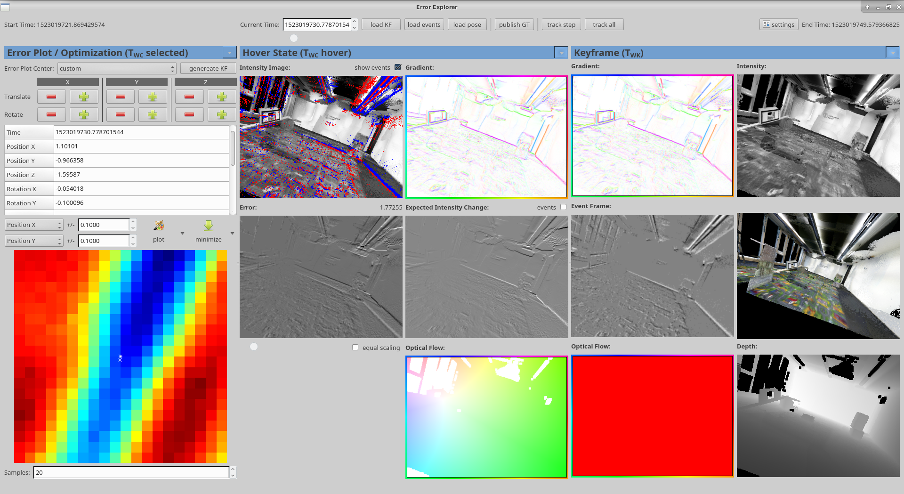
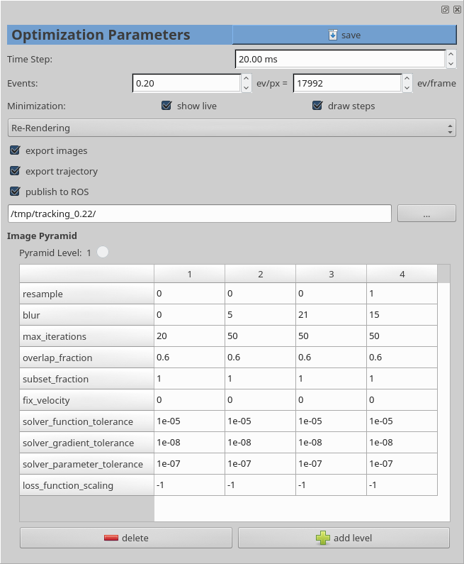

# Event-based, Direct Camera Tracking

[](https://youtu.be/ISgXVgCR-lE)

This is the code corresponding to the ICRA'19 paper **Event-based, Direct Camera Tracking from a Photometric 3D Map using
Nonlinear Optimization** by
[Samuel Bryner](https://sam.klamath.ch/),
[Guillermo Gallego](http://www.guillermogallego.es/),
[Henri Rebecq](http://henri.rebecq.fr),
and [Davide Scaramuzza](http://rpg.ifi.uzh.ch/people_scaramuzza.html).

We provide a [pdf of the paper](http://rpg.ifi.uzh.ch/docs/ICRA19_Bryner.pdf) as well as a [dataset
and video](http://rpg.ifi.uzh.ch/direct_event_camera_tracking/index.html). 
The paper is a summary of Samuel's [MS thesis](doc/MS_thesis.pdf) (and [presentation](doc/MS_thesis_presentation.pdf)).
If you use any of this code, please cite the following publication:

```bibtex
@InProceedings{Bryner19icra,
  author        = {Samuel Bryner and Guillermo Gallego and Henri Rebecq and Davide Scaramuzza},
  title         = {Event-based, Direct Camera Tracking from a Photometric {3D} Map 
                   using Nonlinear Optimization},
  booktitle     = {{IEEE} Int. Conf. Robot. Autom. (ICRA)},
  year          = 2019
}
```

## Table of Contents

  1. [Overview](#overview)
  2. [Installation](#installation)
  3. [Running an Example](#running-an-example)
  4. [Creating a Dataset](#creating-a-dataset)  
    4.1 [Camera Recording (rosbag)](#camera-recording-rosbag)  
    4.2 [3D Intensity Map](#3d-intensity-map)  
    4.3 [Camera Calibration](#camera-calibration)  
    4.4 [Hand-Eye Calibration (Optional)](#hand-eye-calibration-optional)  
    4.5 [Existing Datasets](#existing-datasets)  
  5. [Configuration](#configuration)
  6. [Usage](#usage)  
    6.1 [Tool Bar](#tool-bar)  
    6.2 [Poses](#poses)  
    6.3 [Error Plot](#error-plot)  
    6.4 [General Hints](#general-hints)  
    6.5 [Troubleshooting](#troubleshooting)  
  7. [Scripts](#scripts)


<a name="overview"></a>
## 1. Overview

We track the 6-DoF pose of an event camera by aligning the sensed events with a static, pre-recorded
3D map of the scene. This alignment is an extension of the registration method proposed in
[EKLT: Asynchronous, Photometric Feature Tracking using Events and
Frames](https://github.com/uzh-rpg/rpg_eklt) (Gehrig et. al., 2019 IJCV).
In a nutshell: Given a 3d map and the pose and velocity of an event camera we predict the events
that would be generated at the camera. We can then compare this prediction with the actual event data and
update the pose and velocity until the mismatch is minimized.

----



*Main window of tracking software with poses and keyframes loaded.*

<a name="installation"></a>
## 2. Installation

The software was originally developed and tested against **[ROS Kinetic
Kame](http://wiki.ros.org/kinetic)** and **Ubuntu 16.04 (Xenial Xerus)**. It also runs on **[ROS
Melodic Morenia](http://wiki.ros.org/melodic)** with **Ubuntu 18.04 (Bionic Beaver)**.

Install [catkin tools](http://catkin-tools.readthedocs.org/en/latest/installing.html) and [vcstool](https://github.com/dirk-thomas/vcstool) if needed:

    sudo apt install python-catkin-tools python-vcstool

Create a catkin workspace if not already done so:

    mkdir -p catkin_ws/src
    cd catkin_ws
    catkin config --init --extend /opt/ros/melodic --cmake-args -DCMAKE_BUILD_TYPE=Release

Then clone the repository and pull in all its dependencies using vcs-import:

    cd catkin_ws/src
    git clone https://github.com/uzh-rpg/direct_event_camera_tracker
    vcs-import < direct_event_camera_tracker/dependencies.yaml

This will pull in the following ROS dependencies that are not part of ROS:

 - **Catkin simple:**   https://github.com/catkin/catkin_simple
 - **Ceres:**           https://github.com/ethz-asl/ceres_catkin
 - **glog:**            https://github.com/ethz-asl/glog_catkin
 - **Assimp:**          https://github.com/uzh-rpg/assimp_catkin
 - **DVS messages:**    https://github.com/uzh-rpg/rpg_dvs_ros

The following system dependencies are also required

 - Qt 5.5 or higher (or a bit lower might be fine too)
 - GCC 5.4 or higher (must support the C++14 standard)
 - CMake 3.1 or higher
 - OpenCV 3
 - Eigen 3
 - yaml-cpp
 - PCL 1.7 (only for loading PLY files, could easily be replaced with assimp)
 - Boost
 - sophus (is actually bundled as I had to make some slight adjustments to the code)
 - QCustomPlot
 - GLM

They are all available through the package management of Ubuntu and can be installed using apt:

    sudo apt install build-essential qt5-default cmake libopencv-dev libeigen3-dev \
        libyaml-cpp-dev libpcl-dev ros-melodic-pcl-ros libboost-dev libqcustomplot-dev \
        libglm-dev libproj-dev dh-autoreconf

All the software is contained in a ROS package and can be built and run using catkin:

    catkin build direct_event_camera_tracker
    source catkin_ws/devel/setup.bash

To launch it, you need a running roscore. So in one terminal run

    roscore


In another terminal, pass a path to a configuration file. For example:

    roscd direct_event_camera_tracker
    rosrun direct_event_camera_tracker direct_event_camera_tracker cfg/main.yaml

<a name="running-an-example"></a>
## 3. Running an Example

Download a dataset from http://rpg.ifi.uzh.ch/direct_event_camera_tracking/index.html:

    mkdir /tmp/example/
    cd /tmp/example
    wget http://rpg.ifi.uzh.ch/datasets/davis_inside_out_tracking/bagfiles/room/dvs_recording3_2018-04-06-15-04-19.bag
    wget http://rpg.ifi.uzh.ch/datasets/davis_inside_out_tracking/bagfiles/room/calibration.zip
    wget http://rpg.ifi.uzh.ch/datasets/davis_inside_out_tracking/maps/room/room.ply
    unzip calibration.zip
    rm calibration.zip

Create a configuration file with the following content (you can use the [example
config](direct_event_camera_tracker/cfg/main.yaml) from the respository and adjust the paths. 
It also contains an **explanation of the parameters**):


```yaml
bagfile: "/tmp/example/dvs_recording3_2018-04-06-15-04-19.bag"
map: "/tmp/example/room.ply"
map_type: cloud # 'cloud', 'mesh' or 'auto'

tracking:
    time_step: 20
    event_count_density: 0.25
    # folder to write tracking results to (e.g. images, recovered trajectory, extracted ground truth, etc.)
    export_dir: "/tmp/example/results/"
    #autostart: true
    method: 0
    use_numeric_diff: false
    eventframe_initial_blur: 3

pyramid_defaults:
    solver_function_tolerance:  1e-5
    solver_gradient_tolerance:  1e-8
    solver_parameter_tolerance: 1e-7
    subset_fraction: 1
    fix_velocity: false
    loss_function_scaling: 0.002

levels:
    - resample:   1
      blur:       7
      subset_fraction: 0.4
    - resample:   1

camera:
    near: 1
    far: 40
    calibration: "/tmp/example/calibration/IMU/results/camchain-imucam-.calibration_davis_intrinsics_imu.yaml"
    hand_eye: "/tmp/example/calibration/hand_eye/results/hand_eye.yaml"
```

Then, in your workspace run the software with this config:

    roscd direct_event_camera_tracker
    rosrun direct_event_camera_tracker direct_event_camera_tracker path/to/config.yaml

To run the algorithm follow these steps:

1. Load some events by clicking on "load events".
   You should see a grayscale "Event Frame" image on the right.
   If you get an error saying "start time not available" this means that the currently select time
   window is outside the loaded dataset.  Increase "Current Time" by dragging the slider at the top.
2. Choose an initial pose. For example, load the ground truth pose by clicking on "load pose" in
   the toolbar at the top.
3. Generate a Keyframe from the pose by clicking on "genereate KF". This should fill the two
   rightmost columns.
4. Run tracking by clicking either on "track step" or "track all" to either just optimize the
   current pose or to generate a new keyframe afterwards and thus continue tracking the rest of the
   dataset. "track all" will log results to the `export_dir` set in the config.

You can also run the optimization on just a single pyramid level with the "minimize" button.
Clicking "plot" will generate a visualization of the error function.

<a name="creating-a-dataset"></a>
## 4. Creating a Dataset

To run the algorithm, several pieces of data are required:

<a name="camera-recording-rosbag"></a>
### 4.1 Camera Recording (rosbag)

A rosbag containing:

 - the events (on `/dvs/events` or `/cam0/events`)
 - ground truth (either on `/cam0/pose` and `/cam0/twist` or on `/optitrack/DAVIS_BlueFox`)
 - IMU data (optional, on `/dvs/imu` or `/imu`)
 - keyframes (optional, on `/cam0/image_raw`)

This rosbag can be either a real recording (using the `rpg_dvs_ros` package) or a simulation (from
`rpg_event_camera_simulator`)

<a name="3d-intensity-map"></a>
### 4.2 3D Intensity Map

The map can be either a point cloud (in .PLY format, must include normals; for example generated by
ElasticFusion) or a mesh (in .OBJ format).

Note that there are various coordinate systems in use and you might have to rotate the model to use
the correct one! When exporting as .obj from Blender for the event simulator choose 'Z Up' and 'Y
forward' in the export dialog.

<a name="camera-calibration"></a>
### 4.3 Camera Calibration

The camera calibration must include the intrinsics as well as the extrinsics for the IMU (although
it's not used at all, apart from providing velocity ground-truth information). The software expects
the Kalibr format:

Example camera calibration file:

```YAML
cam0:
  T_cam_imu:
  - [ 0.000965, 0.999790, -0.020456,  0.002266]
  - [-0.999987, 0.000866, -0.004851, -0.002965]
  - [-0.004832, 0.020460,  0.999778, -0.024131]
  - [ 0.0, 0.0, 0.0, 1.0]
  cam_overlaps: []
  camera_model: pinhole
  distortion_coeffs: [-0.084093, 0.053358, -0.000655, -0.000167]
  distortion_model: radtan
  intrinsics: [196.718542, 196.688981, 161.805861, 143.854077]
  resolution: [346, 260]
  rostopic: /dvs/image_raw
```

`camera_model` must be `pinhole` and `distortion_model` must be `radtan`

This calibration can be optained for example with
[Kalibr](https://github.com/ethz-asl/kalibr/wiki/camera-imu-calibration).

<a name="hand-eye-calibration-optional"></a>
### 4.4 Hand-Eye Calibration (Optional)

Hand-Eye calibration for the ground truth (optional). This transforms poses from the motion capture
system (or whatever else you use for getting reference poses) to the camera frame.

Example:

```YAML
calibration:
  translation:
    x: 0.016613688563580
    y: 0.008281589803800
    z: -0.045595510429855
  rotation:
    w: -0.532291887844937
    x: 0.665903167399887
    y: -0.422674269000762
    z: 0.307546386917393
```

How to obtain this calibration depends on how you record your ground truth.

<a name="existing-datasets"></a>
### 4.5 Existing Datasets

All the datasets during development and for publication are available at
http://rpg.ifi.uzh.ch/direct_event_camera_tracking/index.html

To use them, download a trajectory and the corresponding map and calibration data. Unpack to a
folder and edit the configuration file (cfg/main.yaml) to reflect the location of your unpacked
files.

You need to set the following entries: `bagfile`, `map` and `camera_calib`, as well as `hand_eye` if
ground truth is available.

<a name="configuration"></a>
## 5. Configuration



*Settings window showing additional configurable parameters. Can be opened in main window with the
settings button on the top right.*

Many of the settings are set through a [configuration file](direct_event_camera_tracker/cfg/main.yaml). 
See `cfg/main.yaml` for an example and explanation of the parameters. Most values are required.

Some settings can also or only be changed in the GUI. Those changes are not saved.

<a name="usage"></a>
## 6. Usage

After starting the application you probably want to generate a keyframe and an
eventframe, as otherwise some functions will crash, as they assume these exist.

To load these click on "load events" in the toolbar and either
- "load keyframe" from there as well if your recording contains depth and intensity frames
- use "generate KF" from a selected pose from the error plot part on the left if
  there are no keyframes in the rosbag (the usual case). You can click "load pose" first to load a
  pose from the recording (e.g., a ground truth pose).

<a name="tool-bar"></a>
### 6.1 Tool Bar

At the top of the window there are various commands for loading data from the
rosbag and to start tracking. The window also has a slider to select a timestamp in the
rosbag from which data should be loaded.

<a name="poses"></a>
### 6.2 Poses

There are three poses that are used throughout the GUI:

- **Error Plot / Optimization (T_WC selected)**
    The initial state for the optimization and center state for all the plots.
    Can be set by clicking on the 2D error plot.

- **Hover State (T_WC hover)**
    Various plots allow hovering to see the warped images at the pose where the user hovers on
    the plot.
    This pose is hidden by default.

- **Keyframe (T_WK) for pose of the current keyframe**
    Loaded from the rosbag ground through data when using "load keyframe" or copied from selected
    pose when using "generate keyframe".
    This pose is hidden by default.


All pose tables can also be directly edited by double clicking on a value, can
be copy/pasted or even stored/loaded from disk by using the right-click menu
(this also allows to set the rosbag time slider).

Pose tables can be hidden or shown by clicking on the right of the title.

<a name="error-plot"></a>
### 6.3 Error Plot

A 2D plot of the error surface can be generated by clicking on the big "plot" button.
The X- and Y-axes of the plot can be configured with the drop-down menus and the input
fields on the left of the "plot" button.

The fidelity of the graph is set through the number of samples field at the bottom left. 
If rendering is taking too long, set this to a lower value.

The error plot is always plotted with the selected pose at the center and disturbing two parameters
by the given amount (e.g., X and Y translation). Use the dropdowns to choose dimensions.

Clicking on the plot will select that pose.

<a name="general-hints"></a>
### 6.4 General Hints

 - All images can be saved to disk by right-clicking on them.

 - Various elements should have tool-tips that offer a short explanation when hovered over the element.

 - Make sure correct Hand-Eye calibration for poses is configured. Remember to change this if you
   change the model (for example, when loading a simulated environment you do not want to load the
   hand-eye transformation used for a real model).

<a name="troubleshooting"></a>
### 6.5 Troubleshooting

 - Keep an eye on the console for warnings etc.
 - *ERROR: Failed to read depth from framebuffer.*
   Make sure your graphics drivers are working. This might not be the case when running inside a VM.

<a name="scripts"></a>
## 7. Scripts

There are various python scripts which came in handy during development and might be useful for someone else, too:

 - `eval_tracking.py`: Generate plots of trajectories (tracked and ground truth). Used for Figs. 6, 7
   and 10 in the paper.

 - `extract_cloud_from_depth.py`: Extract depth and color images from a rosbag and convert them to a pointcloud.

 - `import_poses.py`: Blender script that converts poses from a CSV file into camera poses in Blender for
   visualization of a trajectory. See also `import_poses_test.blend` for an example.

 - `make_video.py`: Build a video out of irregularly timed images.

 - `output_frame_pos.py`: Blender script that writes the pose of the virtual camera to a CSV file. This
   can be used to create a trajectory by animating a camera in Blender. The trajectory can then be
   fed to [esim](https://github.com/uzh-rpg/rpg_esim) to simulate an event camera moving along this
   trajectory. This makes it easy to create complex virtual trajectories.

 - `posefilter.py`: Live ROS node that calculates the moving average of a 3-DoF pose. Useful for smooth
   visualization of a jittery trajectory.

 - `track_to_bag.py`: Convert a trajectory (CSV file) into a rosbag (PoseStamped messages) that can be played back.
